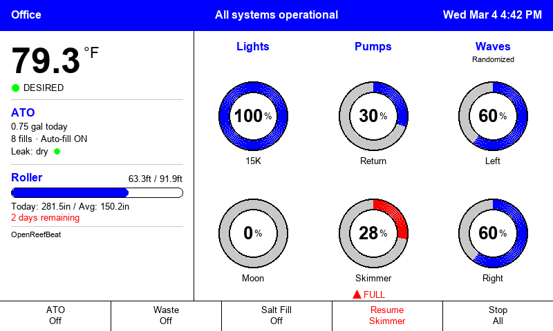

# OpenReefBeat

A reverse-engineered API client for the [Red Sea ReefBeat](https://www.redseafish.com/reefbeat/) aquarium monitoring system, with an e-ink dashboard for the [Pimoroni Inky Frame 7.3"](https://shop.pimoroni.com/products/inky-frame-7-3). Get a glanceable tank dashboard without needing your phone.



## What It Does

OpenReefBeat talks directly to the ReefBeat cloud API, pulling live data from all your connected devices:

- **Water temperature** — large readout in Fahrenheit
- **Water level** with green/red status indicator and ATO fill stats (volume, fill count, auto-fill status)
- **Leak detection** with green/red status indicator
- **Light status** — intensity, color temp, white/blue/moon channels, LED temps, fan speed
- **Pump status** — return and skimmer intensity with sensor status
- **Skimmer cup warning** — red gauge + warning triangle when cup is full
- **Wave pump status** — program name, forward/reverse intensity (left + right)
- **ReefMat roller** — used/total in feet, today and average daily usage in inches, days until replacement, progress bar with color coding
- **Interactive buttons** — toggle ATO, waste, salt fill, skimmer resume, and stop all directly from the display
- **Notifications** — unread alert count

All devices are **auto-discovered** from your ReefBeat account — no manual device ID configuration needed.

## Dashboard

The e-ink display renders an 800x480 dashboard optimized for the Inky Frame's 6-color Spectra palette (black, white, red, green, blue, yellow):

- **Header** — tank name, status indicator (blue = operational, red = alert), date and time via NTP
- **Left panel** — large temperature readout, water level with status dot, ATO stats, leak status with status dot, roller progress bar with used/total in feet and daily usage in inches
- **Right panel** — circular gauges for lights (intensity + moon), pumps (return + skimmer), waves (left + right) with wave program name. Skimmer gauge turns red with warning triangle when cup is full
- **Button bar** — five interactive buttons (A–E) for ATO, waste, salt fill, skimmer resume, and stop all. Labels toggle on press

Refreshes every 5 minutes with live data from the ReefBeat cloud API. An error screen with setup instructions is shown when the device can't connect.

## Quick Start

### 1. Clone and install

```bash
git clone https://github.com/MDamon/OpenReefBeat.git
cd OpenReefBeat
pip install -r requirements.txt
```

### 2. Configure

```bash
cp .env.example .env
```

Edit `.env` with your ReefBeat login (same email and password as the phone app):

```
REEFBEAT_USERNAME=your_email@example.com
REEFBEAT_PASSWORD=your_password
LOCATION=Office
```

That's it — device IDs are auto-discovered from your account.

### 3. Run

```bash
python3 refresh.py
```

```
[2026-02-27T15:52:50] Temp: 79.8°F | Level: desired | Leak: dry | ATO fills today: 8 | Return: operational @ 30% | Skimmer: operational @ 80%
```

### 4. Preview the dashboard (optional)

```bash
python3 display.py
open data/dashboard.png
```

Renders the dashboard as a PNG using the same layout as the e-ink display. Useful for testing without hardware.

### 5. Schedule (optional)

Poll every 5 minutes via cron:

```bash
crontab -e
```

```
*/5 * * * * cd /path/to/OpenReefBeat && python3 refresh.py >> /var/log/openreefbeat.log 2>&1
```

## Inky Frame Setup

The Inky Frame 7.3" is a standalone board with a Pico W running MicroPython. It connects directly to the ReefBeat API over WiFi — no server or Raspberry Pi needed.

### 1. Edit config

Edit `inky_frame/config.py` with your WiFi and ReefBeat credentials:

```python
WIFI_NETWORKS = [
    ("PrimaryNetwork", "password1"),
    ("BackupNetwork", "password2"),
]
USERNAME = "your_email@example.com"
REEFBEAT_PASSWORD = "your_password"
```

Multiple WiFi networks are supported — the device tries each in order until one connects.

### 2. Deploy to the Inky Frame

Copy two files to the device using [mpremote](https://docs.micropython.org/en/latest/reference/mpremote.html) (recommended) or [Thonny](https://thonny.org/):

```bash
pip install mpremote
mpremote cp inky_frame/config.py :config.py
mpremote cp inky_frame/main.py :main.py
mpremote reset
```

### 3. Power on

The Inky Frame will:

1. Connect to WiFi (tries each configured network up to 3 rounds)
2. Sync clock via NTP
3. Log in to ReefBeat and auto-discover your devices
4. Fetch all tank data
5. Render the dashboard
6. Poll for button presses for 5 minutes, then refresh

### Buttons

The five physical buttons on the Inky Frame are mapped to toggle actions:

| Button | Default | Toggled |
|--------|---------|---------|
| A | ATO Off | ATO On |
| B | Waste Off | Waste On |
| C | Salt Fill Off | Salt Fill On |
| D | Resume Skimmer (red) | Stop Skimmer |
| E | Stop All | Resume All |

Pressing a button toggles its label and triggers a display refresh. API integration for button actions is planned.

If WiFi or the API is unreachable, it displays an error screen with setup instructions and retries on the next cycle.

## Project Structure

```
OpenReefBeat/
├── .env.example              # Config template (just credentials + location)
├── requirements.txt          # Python dependencies (requests, python-dotenv, Pillow)
├── reefbeat.py               # API client library with auto-discovery
├── refresh.py                # Data fetcher with history rotation
├── display.py                # PIL dashboard renderer (Mac/Linux preview)
├── inky_frame/
│   ├── config.py             # Inky Frame config (WiFi + ReefBeat login)
│   └── main.py               # MicroPython dashboard for Pico W
├── docs/
│   ├── API.md                # Full API reference
│   └── REVERSE_ENGINEERING.md # How the API was discovered
└── data/                     # Created at runtime, gitignored
    ├── token.json            # Cached OAuth tokens
    ├── snapshot.json         # Latest tank readings
    └── history.jsonl         # Historical log (auto-trimmed to 30 days)
```

## Configuration

All settings live in `.env` (server/desktop) or `inky_frame/config.py` (Pico W):

| Setting | Default | Description |
|---------|---------|-------------|
| `REEFBEAT_USERNAME` | — | Your ReefBeat email |
| `REEFBEAT_PASSWORD` | — | Your ReefBeat password |
| `LOCATION` | — | Display name shown in header (e.g. "Office") |
| `TIMEZONE` | — | Your timezone (e.g. "America/New_York") |
| `HISTORY_DAYS` | 30 | Days of history to retain |
| `AQUARIUM_UID` | auto | Override auto-discovered aquarium |
| `ATO_HWID` | auto | Override auto-discovered ATO device |
| `PUMP_HWID` | auto | Override auto-discovered pump device |
| `LIGHT_HWIDS` | auto | Override auto-discovered lights (comma-separated) |
| `REEFMAT_HWID` | auto | Override auto-discovered ReefMat |

Device IDs are only needed if you have multiple aquariums and want to target a specific one.

## API Documentation

The full API reference is in [docs/API.md](docs/API.md), covering all known endpoints for:

- Authentication (OAuth2 password grant + refresh tokens)
- Aquarium dashboard
- ATO, lights, pumps, wave pumps, ReefMat, dosing
- Notifications
- Firmware versions

The API was reverse-engineered by intercepting the official ReefBeat iOS app using mitmproxy. The full methodology is documented in [docs/REVERSE_ENGINEERING.md](docs/REVERSE_ENGINEERING.md).

## Supported Devices

Tested with the following Red Sea hardware:

| Device | Model |
|--------|-------|
| ReefLED | RSLED115 |
| ReefATO+ | RSATO+ |
| ReefRun | RSRUN (return pump + skimmer) |
| ReefWave | RSWAVE45 |
| ReefMat | RSMAT500 |

Other ReefBeat-connected devices likely work — the API patterns are consistent across device types.

## Roadmap

- [x] **ReefBeat API client** — OAuth2 auth, token caching, all device endpoints
- [x] **Auto-discovery** — no manual device ID configuration needed
- [x] **E-ink dashboard** — Pimoroni Inky Frame 7.3" Spectra with 6-color circular gauge layout
- [x] **Skimmer cup warning** — red gauge + warning triangle when skimmer cup is full
- [x] **Roller detail** — used/total in feet, daily usage in inches, color-coded progress bar
- [x] **Interactive buttons** — five toggle buttons for ATO, waste, salt fill, skimmer resume, stop all
- [x] **Multi-WiFi support** — configure multiple networks with automatic failover
- [x] **History rotation** — auto-trim to 30 days to prevent storage bloat
- [ ] **Button API integration** — wire physical buttons to ReefBeat API commands
- [ ] **Alerts** — local notifications (LED, buzzer, or push) when values go out of range
- [ ] **Multi-tank support** — handle multiple aquariums under one account
- [ ] **Web dashboard** — lightweight local web UI as an alternative to e-ink
- [ ] **Home Assistant integration** — expose sensors as HA entities via MQTT or REST

## Disclaimer

This project is not affiliated with or endorsed by Red Sea. It interacts with the ReefBeat cloud API, which is undocumented and may change without notice. Use at your own risk.

## License

MIT
